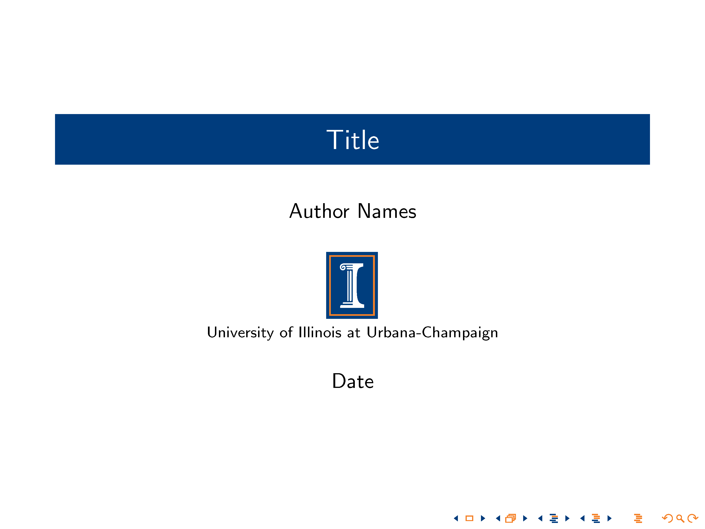
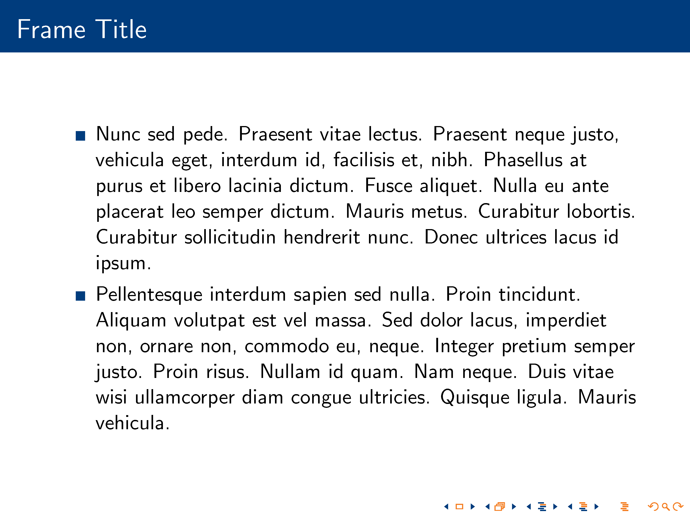
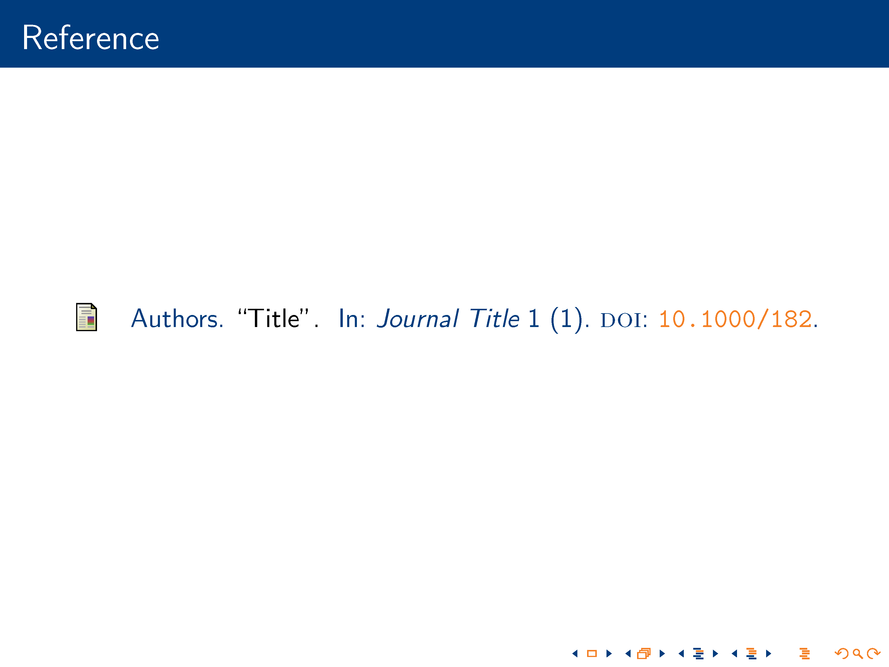
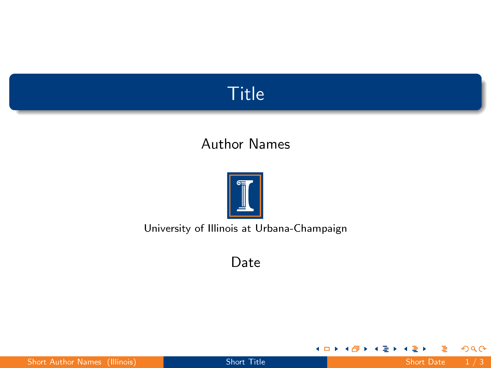
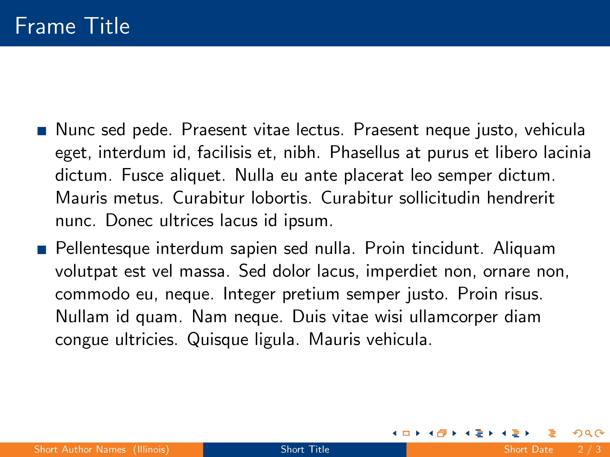
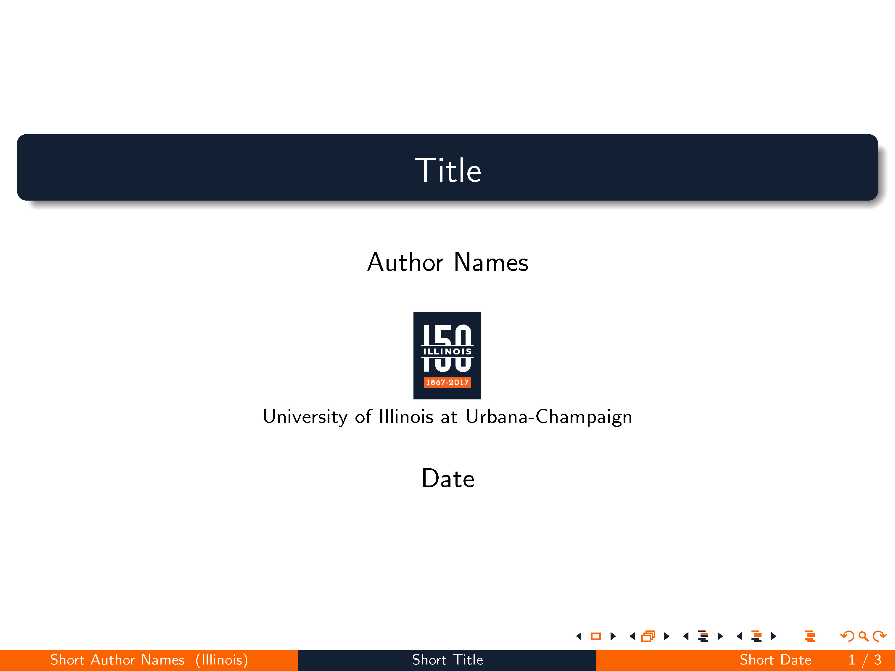
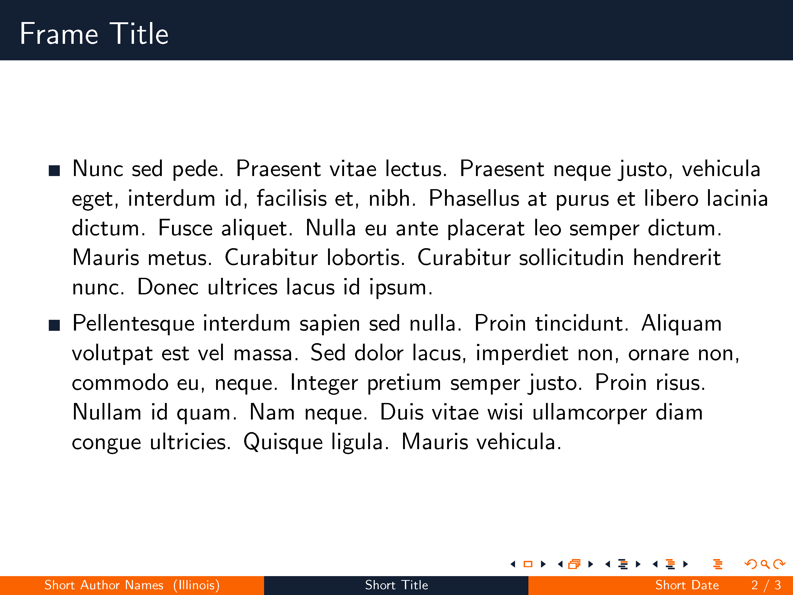
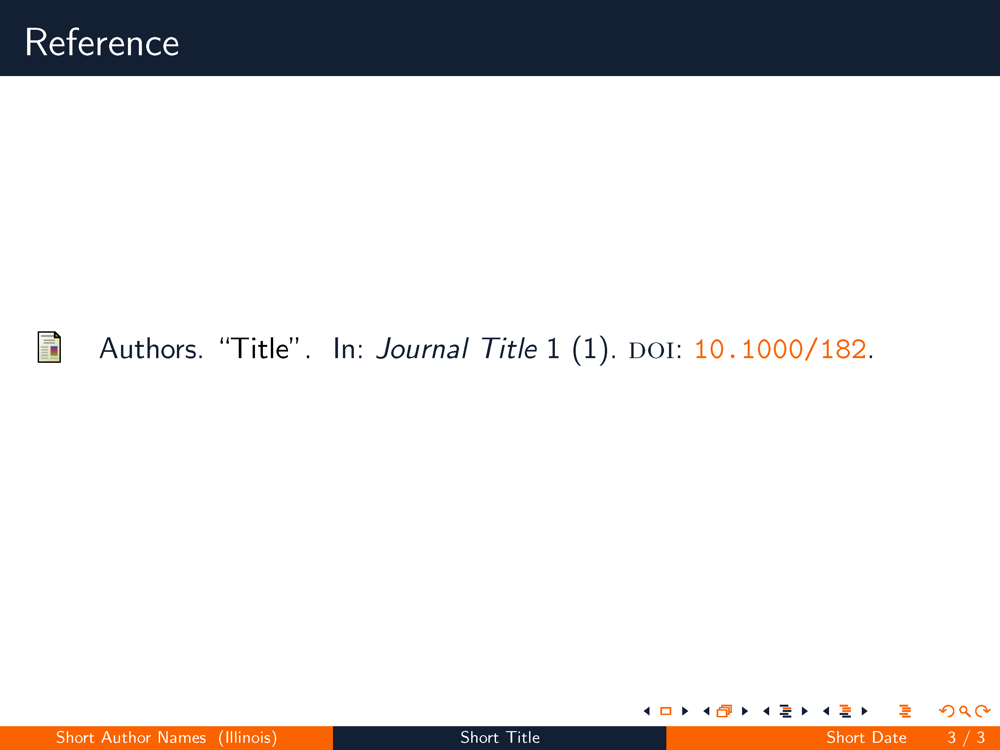

# CU_Beamer

## Description
A University of Illinois themed [Beamer](https://www.ctan.org/pkg/beamer) template. Essentially, this is a palette tailored for `Madrid` theme. It works with other themes as well, however, since it is not fine-tuned for all of them, you may find visual nuisances on occasion.

## Palettes and Logos
University of Illinois has in fact published several versions of the official color palette. The most notable ones are the "old" bold palette (Blue:#003C7D, Orange:#F47F24), which the I-mark logo goes with; and the recent sesquicentennial palette (Blue:#131F33, Orange:#FA6300). The latter features a much darker blue and a brighter orange.

Both palettes are presented in the template. To activate, simply comment/uncomment corresponding lines. The I-mark logo and the sesquicentennial logo (converted from `eps` format) are also included.

## Preview
### default Theme
||| |
|----------|----------|----------|
||||

### Madrid Theme
||| |
|----------|----------|----------|
||||

### Madrid Theme with Sesquicentennial Palette
||| |
|----------|----------|----------|
||||

## Reference
Illinois Identity Standards. (2017, April 21). Retrieved from http://identitystandards.illinois.edu/index.html

