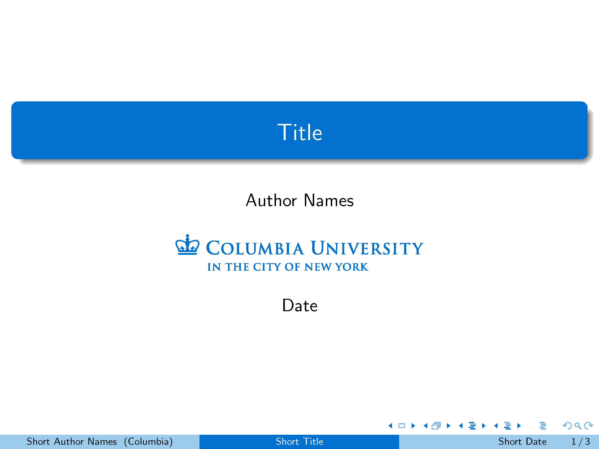
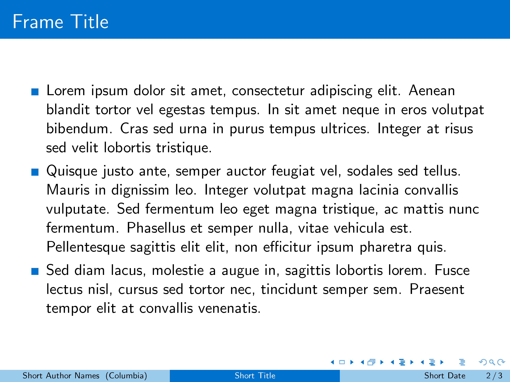
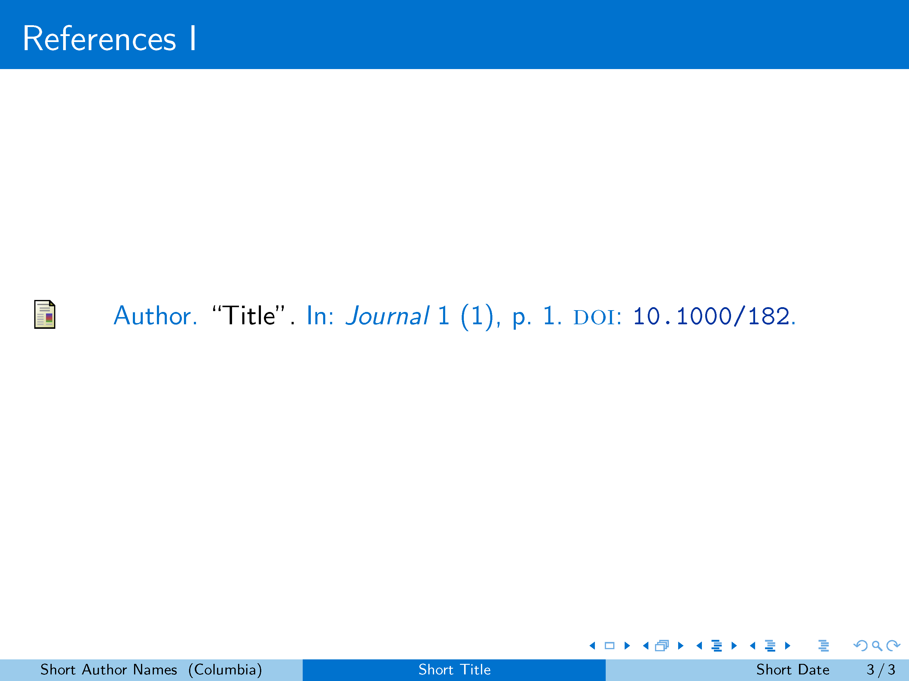
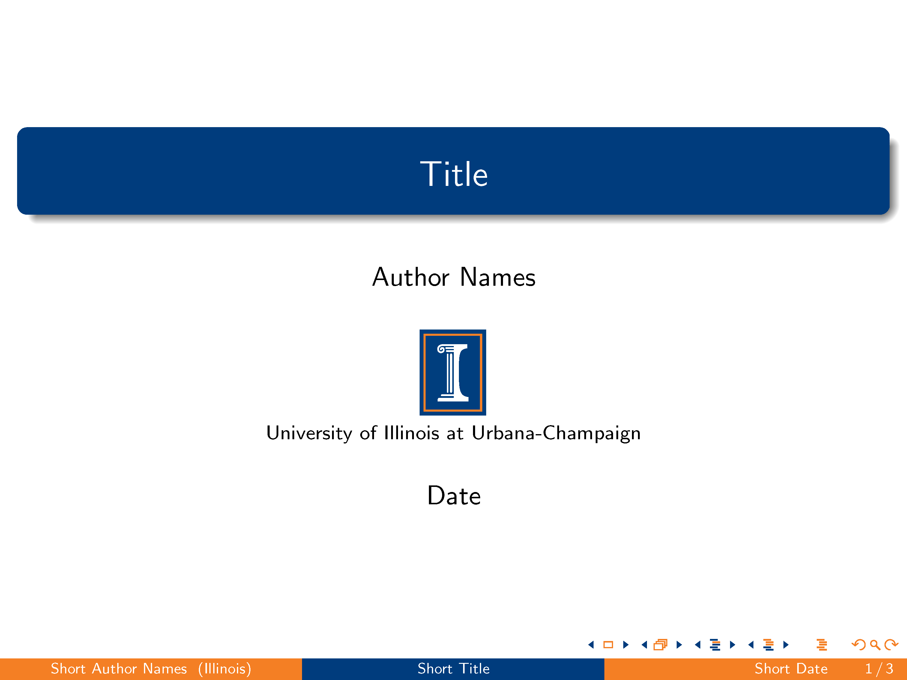
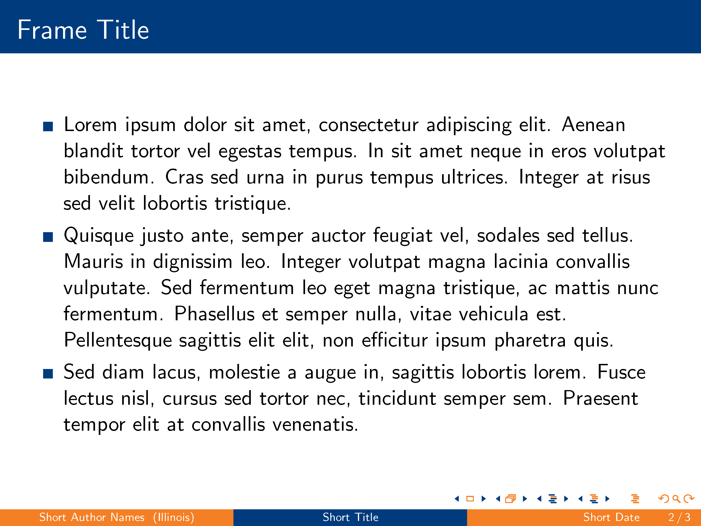
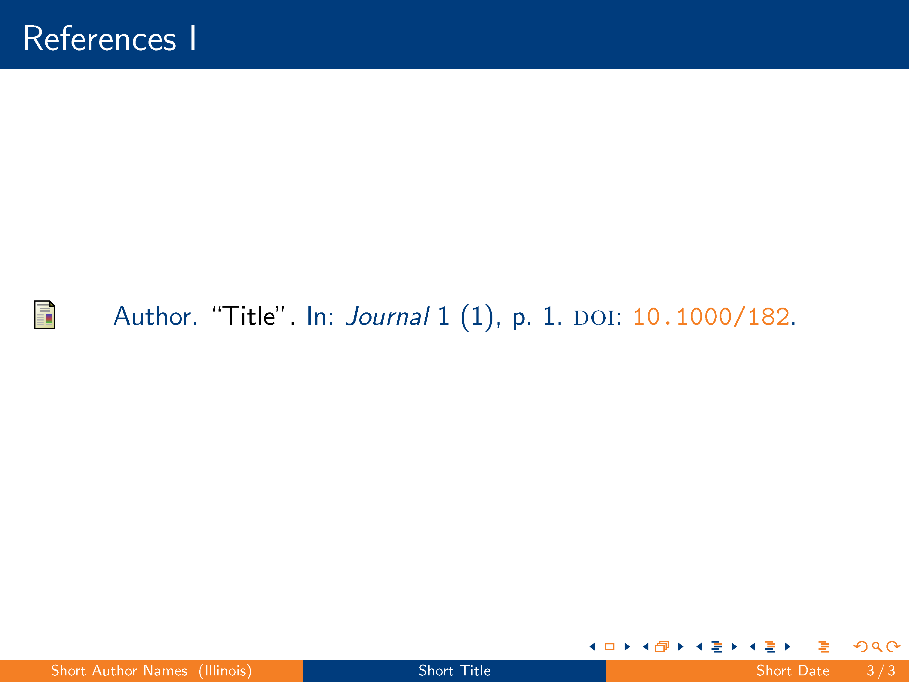
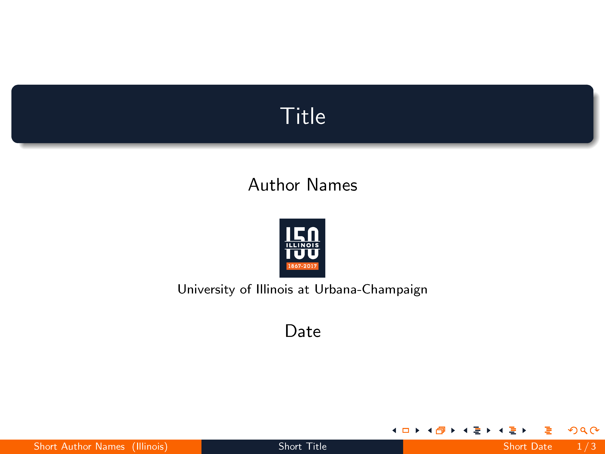
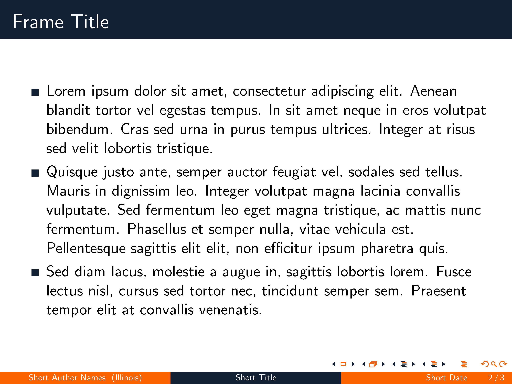
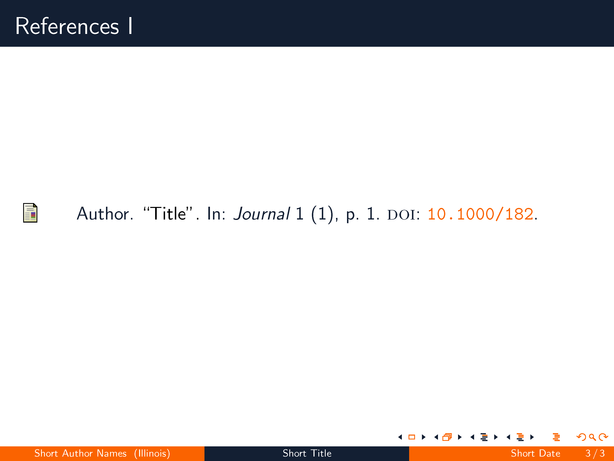

# CU_Beamer

## Description
A collection of homemade [`beamer`](https://www.ctan.org/pkg/beamer) color themes. The palettes are tailored specifically for the `Madrid` theme. Other beamer themes can be used but the result may not be ideal.

## Usage
Make sure the `.sty` files and `.tex` file are in the same folder. Use `\usecolortheme{Columbia}` for the Columbia University theme, `\usecolortheme{CUbold}` for the bold University of Illinois palette, or `\usecolortheme{CUacademic}` for the sesquicentennial University of Illinois palette. 

## Remarks
The Columbia logo, I-mark logo and the sesquicentennial UI logo (modified and converted from `eps` files) are included. For more details on palettes and logo downloads, follow the link in the reference section.

University of Illinois has in fact published several versions of the official color palette. The most notable ones are the "old" bold palette (Blue:`#003C7D`, Orange:`#F47F24`), and the recent (2017) sesquicentennial palette (Blue:`#131F33`, Orange:`#FA6300`). The bold palette has went through some minor changes in 2015, while the latter features a much darker blue and a brighter orange.

## Preview
### Columbia University `Madrid` Theme
||||
|----------|----------|----------|
||||

### University of Illinois `Madrid` Theme
||||
|----------|----------|----------|
||||

### University of Illinois `Madrid` Theme with Sesquicentennial Palette
||||
|----------|----------|----------|
||||

## Reference
Columbia University Web & Identity Guidelines. Retrieved from https://visualidentity.columbia.edu/content/identity-0

Illinois Identity Standards. (2017, April 21). Retrieved from http://identitystandards.illinois.edu/index.html